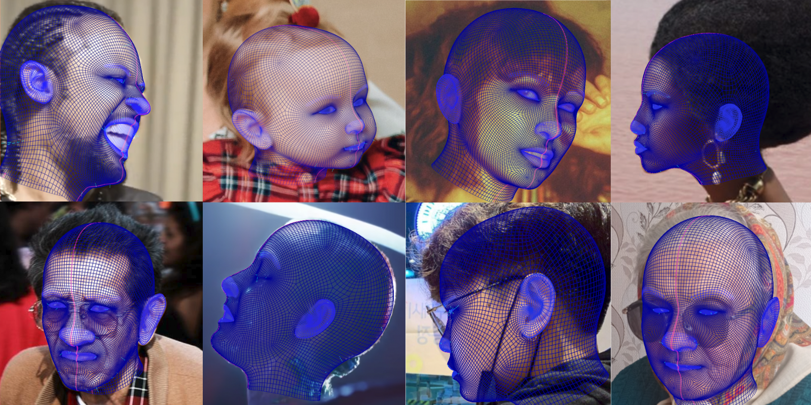
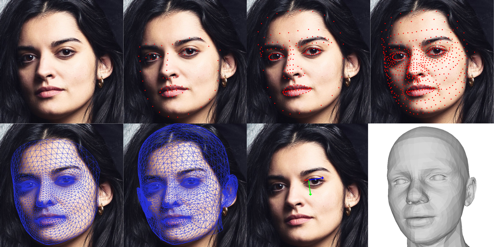

<div align="center">

# DAD-3DHeads: A Large-scale Dense, Accurate and Diverse Dataset for 3D Head Alignment from a Single Image

[](https://arxiv.org/abs/2204.03688)
[](https://cvpr2022.thecvf.com)
[](https://www.pinatafarm.com/research/dad-3dheads/)
[![CC BY-NC-SA 4.0][cc-by-nc-sa-shield]][cc-by-nc-sa]

</div>



This is an official repository for the paper
```
DAD-3DHeads: A Large-scale Dense, Accurate and Diverse Dataset for 3D Head Alignment from a Single Image
Tetiana Martyniuk, Orest Kupyn, Yana Kurlyak, Igor Krashenyi, Jiři Matas, Viktoriia Sharmanska
CVPR 2022
```

## Installation

The code uses **Python 3.8**.

#### Create a Conda virtual environment:

```bash
conda create --name DAD-3DHeads python=3.8
conda activate DAD-3DHeads
```
#### Clone the project and install requirements:

```bash
git clone https://github.com/PinataFarms/DAD-3DHeads.git
cd DAD-3DHeads

pip install -r requirements.txt
```
## Training

#### Prepare the DAD-3DHeads dataset:

First, you need to download the [DAD-3DHeads](https://www.pinatafarm.com/research/dad-3dheads/dataset) dataset and extract it to the `dataset/DAD-3DHeadsDataset` directory. The dataset is available upon request. Please [fill in this form](https://docs.google.com/forms/d/e/1FAIpQLSdo8RPxtFR1xHBJ7gkNHbEse0eYOsHR739b9zZ4BtGWQv49LQ/viewform) to get access to it.

The dataset directory structure should be the following:
```
./dataset
--DAD-3DHeadsDataset
----train
------images
--------<ID>.png
------annotations
--------<ID>.json
------train.json
----val
------images/<ID>.png
------annotations/<ID>.json
------val.json
----test
------images/<ID>.png
------test.json
```

Annotations ```<ID>.json``` file structure:
```
--vertices
--model_view_matrix
--projection_matrix
```

Metadata ```[train|val|test].json``` file structure:
```
--item_id
--annotation_path
--img_path
--bbox #[x, y, w, h] format
----0
----1
----2
----3
--attributes
----quality #[hq, lq]
----gender #[female, male, undefined]
----expression #[true, false]
----age #[child, young, middle_aged, senior]
----occlusions #[true, false]
----pose #[front, sided, atypical]
----standard light #[true, false]
```

The training code uses [hydra](https://hydra.cc/docs/intro/). To change the training setup, add a new or edit the existing `.yaml` file in the `model_training/config` folder.

#### Visualize the ground-truth labels:
```bash
python visualize.py <subset> <id>
```
Pick `subset` from the `train, val, test` options, and the corresponding `item_id` (without file extension).

#### Run training code:

```bash
python train.py
```

## Demo


First row (from left to right): input image, 68 2D face landmarks visualization, 191 2D face landmarks visualization, 445 2D face landmarks visualization.  
Second row (from left to right): face mesh visualization, head mesh visualization, head pose visualization, 3D head mesh.

#### Run demo:
```bash
python demo.py <path/to/input/image.png> <path/to/output/folder> <type_of_output>

# Visualize 68 2D face landmarks
python demo.py images/demo_heads/1.jpeg outputs 68_landmarks

# Visualize 191 2D face landmarks
python demo.py images/demo_heads/1.jpeg outputs 191_landmarks

# Visualize 445 2D face landmarks
python demo.py images/demo_heads/1.jpeg outputs 445_landmarks

# Visualize face mesh
python demo.py images/demo_heads/1.jpeg outputs face_mesh

# Visualize head mesh
python demo.py images/demo_heads/1.jpeg outputs head_mesh

# Visualize head pose
python demo.py images/demo_heads/1.jpeg outputs pose

# Get 3D mesh .obj file
python demo.py images/demo_heads/1.jpeg outputs 3d_mesh

# Get flame parameters .json file
python demo.py images/demo_heads/1.jpeg outputs flame_params
```

## License

This work is licensed under a
[Creative Commons Attribution-NonCommercial-ShareAlike 4.0 International License][cc-by-nc-sa].

[![CC BY-NC-SA 4.0][cc-by-nc-sa-image]][cc-by-nc-sa]

[cc-by-nc-sa]: http://creativecommons.org/licenses/by-nc-sa/4.0/
[cc-by-nc-sa-image]: https://licensebuttons.net/l/by-nc-sa/4.0/88x31.png
[cc-by-nc-sa-shield]: https://img.shields.io/badge/License-CC%20BY--NC--SA%204.0-lightgrey.svg

By using this code, you acknowledge that you have read the license terms, understand them, and agree to be bound by them. If you do not agree with these terms and conditions, you must not use the code.

## Citation

If you use the DAD-3DHeads Dataset and/or this code - implicitly or explicitly - for your research projects, please cite the following paper:

```
@inproceedings{dad3dheads,
    title={DAD-3DHeads: A Large-scale Dense, Accurate and Diverse Dataset for 3D Head Alignment from a Single Image},
    author={Martyniuk, Tetiana and Kupyn, Orest and Kurlyak, Yana and Krashenyi, Igor and Matas, Ji\v{r}i and Sharmanska, Viktoriia},
    booktitle = {Proc. IEEE Conf. on Computer Vision and Pattern Recognition (CVPR)},
    year={2022}
}
```
