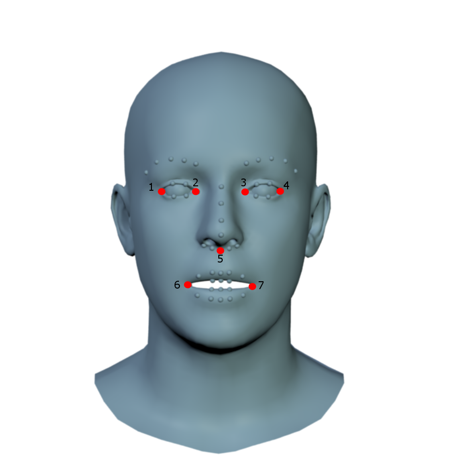

# DAD-3DHeads Benchmark

This is the official repository for [DAD-3DHeads Benchmark](https://www.pinatafarm.com/research/dad-3dheads/) evaluation.

DAD-3DHeads is a novel benchmark with the evaluation protocol for quantitative assessment of 3D dense head fitting, i.e. 3D Head Estimation from dense annotations.

## Evaluation metrics

Given a single monocular image, the aim is to densely align 3D head to it.  
The goodness-of-fit of the *predicted mesh* to the *pseudo ground-truth one* (from here on - *GT mesh*) provided in [DAD-3DHeads dataset](https://www.pinatafarm.com/research/dad-3dheads/dataset) measures the pose fitting, and both face and head shape matching.

DAD-3DHeads Benchmark consists of 4 metrics:
1) **Reprojection NME**: normalized mean error of the reprojected 3D vertices onto the image plane, taking X and Y coordinates into account.   
   We use head bounding box size for normalization.

   The metric is computed on [MultiPIE](https://www.researchgate.net/publication/240446286_Multi-PIE) 68 landmarks.  
   We resort to this classical configuration in order to cover the widest range of methods, as not all of them follow the same topology ([FLAME](https://flame.is.tue.mpg.de)) as DAD-3DHeads dataset and DAD-3DNet do.

   **To have this metric evaluated, your submission has to contain 68 predicted 2D landmarks.**


2) **$Z_n$ accuracy**: a novel metric in our evaluation protocol.     
   As our annotation scheme is conditioned only upon model prior and the reprojection onto the image, we cannot guarantee the absolute depth values to be as accurate as sensor data. We address this issue by measuring the *relative* depth as an ordinal value of the $Z$-coordinate.     
   For each of $K$ vertices $v_i$ of the GT mesh, we choose $n$ closest vertices $\{v_{i_1} , ..., v_{i_n} \}$, and calculate which of them are closer to (or further from) the camera. Then, we compare if for every predicted vertex $w_i$ this configuration is the same:

   $$\text{\quad}Z_n = \frac{1}{K}\frac{1}{n}\sum_{i=1}^K \sum_{j=1}^n\Big((v_i \succeq_z v_i^j) == (w_i \succeq_z w_i^j)\Big).$$

   We do so on the ”head” subset of the vertices only (see Fig.12 in Supplementary of the [DAD-3DHeads paper](https://arxiv.org/abs/2204.03688)).

   **To have this metric evaluated, the submission has to contain predicted mesh in FLAME topology (5023 3D vertices).**


3) **Chamfer distance**: as $Z_n$ metric is valid only for predictions that follow FLAME mesh topology, we add Chamfer distance to measure the accuracy of fit.   
   To ensure generalization to any number of predicted vertices, we measure a one-sided Chamfer distance from our GT mesh to the predicted one.   
   We align them by seven keypoint correspondences (see [RingNet](https://ringnet.is.tue.mpg.de) and [NoW Benchmark](https://github.com/soubhiksanyal/now_evaluation) for the reference), and compute the distances over the ”face” subset of the vertices only (see Fig. 12 in Supplementary).  
   **To have this metric evaluated, the submission has to contain 7 aforementioned 3D landmarks** (see the image below, and go to [NoW Benchmark](https://github.com/soubhiksanyal/now_evaluation) for more details).  
   It is required for rigid alignment between the predicted mesh and the GT mesh.
   <p align="center">   
     
   </p> 


4) **Pose error**: we measure accuracy of pose prediction based on rotation matrices:  
   $$\text{\quad\quad\quad\quad}Error_{pose} = ||I-R_{pred} R_{GT}^{T}||_F$$

   To compare the matrices $R_{pred}$ and $R_{GT}$, we calculate the difference rotation $R_{pred} R_{GT}^T$ , and measure Frobenius norm of the matrix $I − R_{pred} R_{GT}^T$.

   **To have this metric evaluated, the submission has to contain a $3\times3$ rotation matrix.**


For more details, see the [DAD-3DHeads paper](https://arxiv.org/abs/2204.03688).

```  
DAD-3DHeads: A Large-scale Dense, Accurate and Diverse Dataset for 3D Head Alignment from a Single Image  
Tetiana Martyniuk, Orest Kupyn, Yana Kurlyak, Igor Krashenyi, Jiři Matas, Viktoriia Sharmanska  
CVPR 2022  
```  

## Installation

Make sure you have DAD-3DHeads requirements installed (see **Installation** section in the ***README.md*** in the parent **DAD-3DHeads** folder).

Install [*kaolin*](https://kaolin.readthedocs.io/en/latest/notes/installation.html) by running the commands below:

```  
git clone --recursive https://github.com/NVIDIAGameWorks/kaolin  
cd kaolin  
git checkout v0.12.0  
python setup.py develop  
```  
Please check this [webpage](https://kaolin.readthedocs.io/en/latest/notes/installation.html) if you run into any trouble with *kaolin* installation.

## Evaluation

Download the DAD-3DHeads dataset from the [DAD-3DHeads project webpage](https://www.pinatafarm.com/research/dad-3dheads/dataset), and predict 3D faces for all validation/test images.

Your submission should be a ```.json``` file with the following contents:
```  
{
'item_ID': {
   '68_landmarks_2d': list (len 68) of lists (len 2) of floats - 68 predicted 2D landmarks, 
   'N_landmarks_3d': list (arbitrary len) of lists (len 3) of floats - N predicted 3D landmarks, 
   '7_landmarks_3d': list (len 7) of lists (len 3) of floats - 3D coordinates of 7 landmarks for rigid alignment,    
   'rotation_matrix': list (len 3) of lists (len 3) of floats - 3x3 matrix
 },
'item_ID': {...},
...
}
```  

In other words, it should be a `dict` with the `item_ID`s as keys, and the corresponding predictions as values.
Each prediction itself is also a dict with the keys (or subset of these keys): `'68_landmarks_2d', 'N_landmarks_3d', '7_landmarks_3d', 'rotation_matrix'`, while the values are lists of lists of floats.
Please be careful with following this particular file format, and the way to arrange your predictions.
Please see the `data/sample_submission.json` for the reference.

To evaluate on DAD-3DHeads validation set,
* generate GT `.json` for validation set:
    * run `python generate_gt.py <base_path>`
    * `<base_path>` is the path to the folder where you store `DAD-3DHeadsDataset`
* run `python benchmark.py <your_submission_path>`.


Note that GT annotations are only provided for the validation set. **In order to evaluate your model on DAD-3DHeads test set, please submit the test set predictions to the following e-mails (please cc all of them):**.
* dad3dheads@gmail.com


## License

This work is licensed under a  
[Creative Commons Attribution-NonCommercial-ShareAlike 4.0 International License][cc-by-nc-sa].

[![CC BY-NC-SA 4.0][cc-by-nc-sa-image]][cc-by-nc-sa]

[cc-by-nc-sa]: http://creativecommons.org/licenses/by-nc-sa/4.0/
[cc-by-nc-sa-image]: https://licensebuttons.net/l/by-nc-sa/4.0/88x31.png
[cc-by-nc-sa-shield]: https://img.shields.io/badge/License-CC%20BY--NC--SA%204.0-lightgrey.svg

By using this code, you acknowledge that you have read the license terms, understand them, and agree to be bound by them.   
If you do not agree with these terms and conditions, you must not use the code.

## Citing

The codebase for DAD-3DHeads Benchmark belongs to the [DAD-3DHeads project](https://www.pinatafarm.com/research/dad-3dheads/).  
If you use the DAD-3DHeads Benchnmark code and/or its evaluation results - implicitly or explicitly - for your research projects, please cite the following paper:

```  
@inproceedings{dad3dheads,  
   title={DAD-3DHeads: A Large-scale Dense, Accurate and Diverse Dataset for 3D Head Alignment from a Single Image}, 
   author={Martyniuk, Tetiana and Kupyn, Orest and Kurlyak, Yana and Krashenyi, Igor and Matas, Ji\v{r}i and Sharmanska, Viktoriia}, 
   booktitle={Proc. IEEE Conf. on Computer Vision and Pattern Recognition (CVPR)}, 
   year={2022}
}  
```
